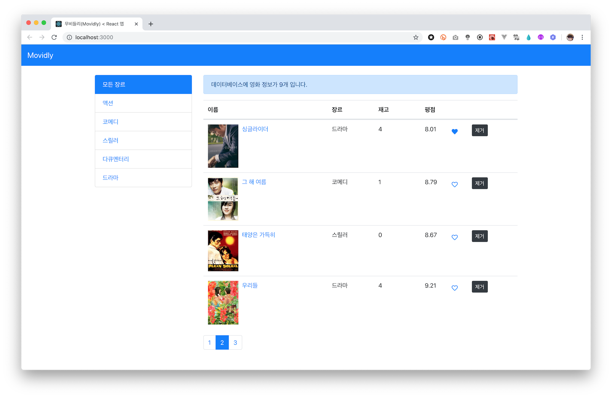

# React Native 러닝 가이드

JavaScript + React → Native App(iOS, Android) 😍

### 🤐 학습 자료

React 애플리케이션 학습 자료를 다운로드 받아 실습을 진행합니다.

➪ [학습 자료](https://github.com/yamoo9/react-native/archive/react-01-ex.zip) 다운로드

<br>

## Movidly 프로젝트

React 라이브러리를 활용해 영화 정보를 테이블, 페이지네이션, 리스트 그룹(필터링)으로 제공하는 페이지를 제작해봅니다.



### 프로젝트 디렉토리

프로젝트 실습 과정에서 제작할 디렉토리 구조를 미리 살펴봅시다.

```sh
src/
├── App.css # 앱 스타일링
├── App.jsx # 앱 컴포넌트
├── components/ # 컴포넌트 디렉토리
│   ├── Movies.jsx # 무비 컴포넌트
│   └── common/ # 공통 컴포넌트
│       ├── LikeButton.jsx # 라이크 버튼 컴포넌트
│       ├── ListGroup.jsx # 리스트 그룹 컴포넌트
│       └── Pagination.jsx # 페이지네이션 컴포넌트
├── index.css # 엔트리 스타일링
├── index.js # 엔트리
├── services/ # 서비스
│   ├── genreService.js # 장르 서비스
│   └── movieService.js # 무비 서비스
└── utils/ # 유틸리티 함수
    └── paginate.js # 페이지네이트 유틸리티
```

<br>

## 프로젝트 시작

#### Create React App

[yarn](https://yarnpkg.org) 패키지를 사용해 React 프로젝트 **Movidly**를 생성합니다.

```sh
$ yarn create react-app movidly
$ cd movidly
```

#### UI 프레임워크 추가

프로젝트를 신속하게 진행하기 위해 [Bootstrap](https://getbootstrap.com/)을 프로젝트에 추가합니다.

```sh
$ yarn add bootstrap
```

#### 설치한 UI 프레임워크 로드

프로젝트 루트 위치에서 `index.js` 파일을 열어 다음 코드를 작성합니다.

```js
import 'bootstrap/dist/css/bootstrap.min.css'
```

#### index.html 수정

public/index.html 파일을 열어 아래 부분을 찾아 수정합니다.

```html
<!DOCTYPE html>
<html lang="ko-KR">
  <!-- ... -->
  <title>Movidly</title>
  <!-- ... -->
</html>
<body>
  <noscript>이 앱을 정상적으로 실행시키려면 JavaScript를 실행할 수 있어야 합니다.</noscript>
  <!-- ... -->
</body>
```

#### App 템플릿 작성

[Bootstrap Start Template](https://getbootstrap.com/docs/4.3/examples/starter-template/)을 참고해 `App.jsx` 파일에 JSX를 작성합니다.

```js
import React from 'react'
import './App.css'

function App() {
  return (
    <main className="container" role="main">
      <h1>헬로! React</h1>
    </main>
  )
}

export default App
```

#### 무비, 장르 서비스 추가

모던 JavaScript 실습 과정에서 작성한 services 디렉토리를 프로젝트 `src/` 위치로 이동시킵니다.

> 필요한 부분에 `export`를 추가해 모듈을 내보내도록 설정합니다.

```sh
src/
└── services/
    ├── genreService.js
    └── movieService.js
```

#### 프로젝트 개발 서버 구동

프로젝트를 시작한 후, 정상적으로 UI 프레임워크를 불러왔는지 확인합니다.

```sh
$ yarn start
```
