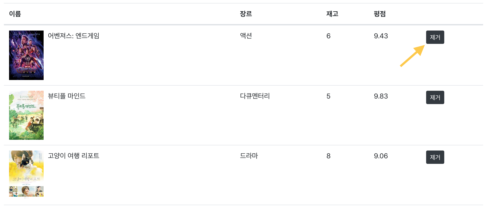

# React Native 러닝 가이드

JavaScript + React → Native App(iOS, Android) 😍

### 🤐 학습 자료

React 애플리케이션 학습 자료를 다운로드 받아 실습을 진행합니다.

➪ [학습 자료](https://github.com/yamoo9/react-native/archive/react-02-ex.zip) 다운로드

<br>

## Movies 컴포넌트

movieService 파일의 영화 정보 데이터를 테이블로 렌더링하는 컴포넌트를 작성해봅니다.
그리고 각 행의 제거 버튼을 클릭하면 행이 제거되는 기능 또한 추가해봅니다.


### 컴포넌트 생성

`src/components/Movies.jsx` 파일을 생성합니다.

```jsx
import React, { Component } from 'react'

class Movies extends Component {
  render() {
    return <h2>Movies 컴포넌트</h2>
  }
}

export default Movies
```

이어서 `src/App.jsx`에서 Movies 컴포넌트를 불러와 JSX 구문을 사용해 React 요소를 추가합니다.

```jsx
import Movies from './components/movies'

function App() {
  return (
    <main className="container">
      <Movies />
    </main>
  )
}

export default App
```

### 테이블 마크업

[Bootstrap > Tables](https://getbootstrap.com/docs/4.3/content/tables/) 구조를 참고해
"무비 대여/평점 표"를 Movies 컴포넌트에 작성합니다.
\<caption\> 요소에 추가된 [sr-only](https://getbootstrap.com/docs/4.3/utilities/screen-readers/)는 스크린 리더에서만 읽히도록 설정하는 유틸리티 클래스 입니다.

```jsx
return (
  <table className="table">
    <caption className="sr-only">무비 대여/평점 표</caption>
    <thead>
      <tr>
        <th scope="col">이름</th>
        <th scope="col">장르</th>
        <th scope="col">재고</th>
        <th scope="col">평점</th>
      </tr>
    </thead>
    <tbody>
      <tr>
        <td>영화 이름</td>
        <td>영화 장르</td>
        <td>영화 재고</td>
        <td>영화 평점</td>
      </tr>
    </tbody>
  </table>
)
```

### 영화 서비스 → 상태 업데이트

무비 서비스를 불러온 후, `getMovies()` 함수를 사용해 '마운트 이후' 시점에 상태(state)를 업데이트 합니다.

```jsx
import { getMovies } from '../services/movieService'

class Movie extends Component {
  state = {
    movies: [],
  }
  componentDidMount() {
    this.setState({
      movies: getMovies(),
    })
  }
}
```

### 테이블 리스트 렌더링

[Bootstrap > Images](https://getbootstrap.com/docs/4.3/content/images/) 구조를 참고해 영화 이름(포스터 포함), 장르, 재고, 평점을 JSX 코드로 리스트 렌더링 합니다.

```jsx
<tbody>
  {this.state.movies.map(movie => (
    <tr key={movie._id}>
      <td>
        
        {movie.title}
      </td>
      <td>{movie.genre.name}</td>
      <td>{movie.numberInStock}</td>
      <td>{movie.dailyRentalRate}</td>
    </tr>
  ))}
</tbody>
```

### 제거 버튼 이벤트 핸들링

[Bootstrap > Buttons](https://getbootstrap.com/docs/4.3/components/buttons/) 구조를 참고해 테이블 행을 제거하는 버튼을 추가합니다.



```jsx
return (
  <table className="table">
    <caption className="sr-only">무비 대여/평점 표</caption>
    <thead>
      <tr>
        <th scope="col">이름</th>
        <th scope="col">장르</th>
        <th scope="col">재고</th>
        <th scope="col">평점</th>
        <th />
      </tr>
    </thead>
    <tbody>
      {this.state.movies.map(movie => (
        <tr key={movie._id}>
          <td>
            
            {movie.title}
          </td>
          <td>{movie.genre.name}</td>
          <td>{movie.numberInStock}</td>
          <td>{movie.dailyRentalRate}</td>
          <td>
            <button className="btn btn-dark btn-sm">제거</button>
          </td>
        </tr>
      ))}
    </tbody>
  </table>
)
```

테이블 행을 지우는 `handleDelete()` 컴포넌트 메서드를 작성한 후,
버튼 요소 클릭 이벤트에 연결합니다.

```jsx
class Movies exntends Component {
  // ...
  handleDelete = movie => {
    const movies = this.state.movies.filter(m => m._id !== movie._id)
    this.setState({
      movies,
    })
  }
  render() {
    return (
      // ...
      <button
        onClick={e => this.handleDelete(movie)}
        className="btn btn-dark btn-sm">
        제거
      </button>
    )
  }
}
```
